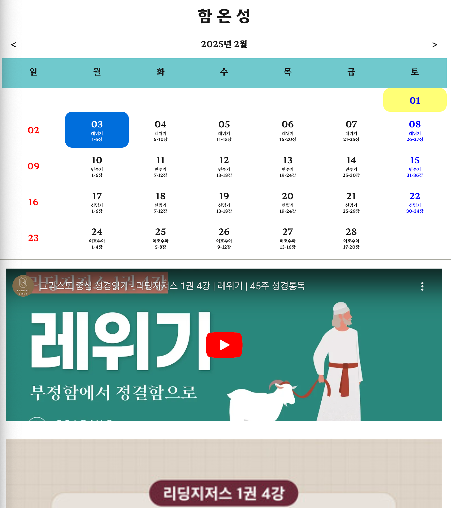

# 함온성(함께읽는 온라인 성경일독)

A website that helps you read through the Bible in year.
[https://bible-reading-nu.vercel.app/](https://bible-reading-nu.vercel.app/)


## Stack

- [Next.js](https://nextjs.org/) - A React framework with hybrid static & server rendering
- [Taliwind CSS](https://tailwindui.com/css) - A utility CSS framework.
- [HeadlessUI](https://headlessui.com/) - Accessible UI component for React, designed to work with Taliwind CSS
- [react-calendar](https://projects.wojtekmaj.pl/react-calendar/) - A customizable calendar component for React
- [Zustand](https://zustand-demo.pmnd.rs/) - A React state management tool

## Project structure

```
$PRJECT_ROOT
├── app           # Page files
├── components    # React component files
├── constants     # Bible files
├── page          # API files
├── stores        # Zustand files
└── type          # Type files
```

## License

MIT License


